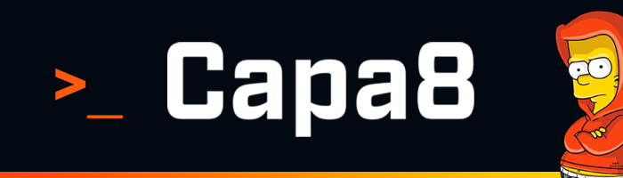

<p align="center">
  
</p>

# ¡Hola! Soy Fabrizio Fernandini 👋

**Estudiante de Analista Programador Computacional @ Duoc UC**  
*Desarrollo de Software | Entornos Linux | Ciberseguridad*

---

### 🚀 Sobre mí

```bash
capa8@github:~$ cat about_me.txt
> Estudiando Analista Programador Computacional en Duoc UC.
> 💻 Enfocado en el desarrollo con Java y diseño/gestión de Bases de Datos.
> 🐧 Usuario activo de Linux y explorando Ciberseguridad Ofensiva (Kali Linux).
> 📜 Certificaciones: Microsoft Azure Fundamentals (AZ-900) | Scrum Developer
```

---

### 🛠️ Tecnologías y Herramientas

**Desarrollo & Bases de Datos**


**Diseño & CMS**


**Sistemas, Cloud & Metodologías**


---

### 📊 Estadísticas de GitHub

<div>
  <a href="https://github.com/Capa8cl">
    
  </a>
  <a href="https://github.com/Capa8cl">
    
  </a>

  
</div>
---
### Contáctame

<p>
<a href="https://www.linkedin.com/in/fabrizio-fernandini-o%C3%B1ate-26943a72/"></a>
</p>